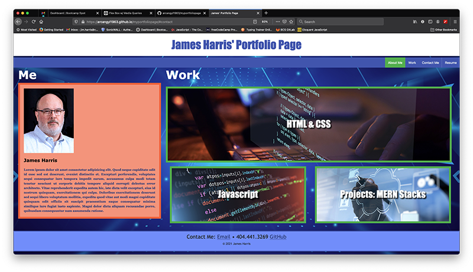

# Week2_MyPortfolioPage

## Description

The assignment here was to design a portfolio page to showcase web applications and projects created during this course. This one was considerably more challenging to meet all the criteria. I focused initially on outlining the structures and color theme for the page before writing any code. I researched some of the technologies for CSS that were to be used prior to and during the coding process. I believe I was able to meet the assignment requirements.

## Installation

My files can be accessed in the repository [HERE](https://github.com/arcangyl1963/myportfoliopage)
The image below shows the repository where my project files are located:

The web application can be viewed [HERE](https://arcangyl1963.github.io/myportfoliopage/).

The image below shows the updated web page layout remains unchanged with the modifications to the code: 

© 2021 arcangyl studios